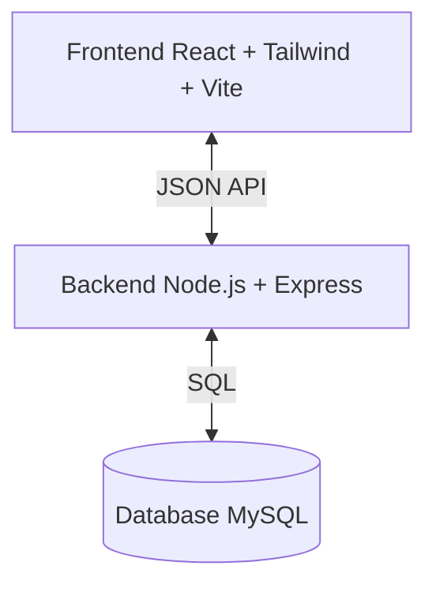

# 📦 Multi-Source Product Review Aggregator — Full-Stack Application

**(Course: JavaScript Full-Stack Web Development — L3 LPECMN — Fall 2025)**

`Full-Stack` • `React` • `Node.js` • `Express` • `MySQL` • `Review Aggregation`

## 🎯 Overview

This project is a complete full-stack web application that aggregates product reviews from multiple sources.
It was developed as part of the L3 Full-Stack Web Development course.

It demonstrates:

**✅ Full-stack architecture**
* React (Vite) frontend (components, hooks, state)
* Node.js + Express backend (REST API)
* MySQL database (persistent storage)
* Mock scraper service simulating external e-commerce reviews

**✅ Key Features**
* 27 products (camera, film, drones, action cams)
* Filtering by category, brand, rating
* Pagination (9 items/page)
* Review aggregation from multiple sources
* User review submission
* Real database persistence
* Live statistics (average rating, counts, source breakdown)

This is a teaching-quality project following industry best practices and course expectations.

## 🏗️ Architecture



*Or text representation:*
```text
Frontend (React + Tailwind + Vite)
          ↕ JSON API
Backend  (Node.js + Express)
          ↕ SQL
Database (MySQL)
```

## 🔑 High-Level Features

* 📦 **Product catalog** with advanced filtering
* ⭐ **User review system**
* 🔍 **Scraper simulation** with random review generation
* 📊 **Analytics:** average rating, histogram, breakdown by source
* 🧹 **Automatic duplicate review prevention** (UNIQUE KEY)
* ⚠️ **Proper error handling + validation**

## 🔥 Core Features (Detailed)

### 1️⃣ Product Catalog & Navigation
* List of 27 products
* Each card shows:
    * image
    * name
    * price
    * brand
    * review count (live from DB)
* **Filtering:**
    * Category (Camera / Drone / Action Cam)
    * Brand (Canon, Nikon, Sony…)
    * Rating (4★+, 5★…)
* Pagination resets to page 1 when filters change.

### 2️⃣ Review Aggregation (Scraping Simulation)
* Backend includes a mock scraper (`services/mockScraper.js`)
* Fetches random reviews from 3 sources:
    * Amazon
    * BestBuy
    * Walmart
* 1 fetch = 50 random reviews
* Backend inserts only unique reviews:
    * `UNIQUE(product_id, source, reviewer_name, content)`

**Response example:**
> Fetched 50 reviews → Saved 17 new reviews.

### 3️⃣ User Reviews
* Users can submit:
    * name
    * rating 1–5
    * comment
* Saved to MySQL instantly
* Review list auto-updates

### 4️⃣ Statistics & Analytics
The backend computes real-time stats:
* Average rating (1 decimal)
* Total reviews
* Source breakdown (Amazon/BestBuy/Walmart)
* Rating histogram (1★ → 5★)

### 5️⃣ Bonus Features Implemented
* Side-by-side product comparison bar
* Product specifications stored in JSON in MySQL
* Clean data modeling (products, reviews)

---

## ⚙️ Project Setup

### 📥 1. Clone Repository
```bash
git clone [https://github.com/Quangnguyen269/WEB-LANGUAGE-PROJECT.git](https://github.com/Quangnguyen269/WEB-LANGUAGE-PROJECT.git)
cd WEB-LANGUAGE-PROJECT
```

### 🗄️ 2. Database Setup (MySQL)
Open MySQL Workbench, then run:
` /database/schema.sql `

This script:
* ✔ creates database
* ✔ creates tables
* ✔ inserts 27 products
* ✔ seeds random reviews

### 🛠️ 3. Backend Setup (Express)
```bash
cd server
npm install
```

Create `.env`:
```env
DB_HOST=127.0.0.1
DB_USER=root
DB_PASSWORD=YOUR_PASSWORD
DB_NAME=review_db
PORT=4000
```

Run backend:
```bash
npm run dev
```
Server → `http://localhost:4000`

### 🎨 4. Frontend Setup (React)
```bash
cd client
npm install
npm run dev
```
Frontend → `http://localhost:5173`

---

## 📡 API Overview

### Product Endpoints
| Method | Endpoint | Description |
| :--- | :--- | :--- |
| **GET** | `/api/products` | List products (with review count) |
| **GET** | `/api/products/:id` | Product detail |
| **POST** | `/api/products/:id/fetch` | Fetch external reviews (mock scraper) |

### Review Endpoints
| Method | Endpoint | Description |
| :--- | :--- | :--- |
| **POST** | `/api/products/:id/reviews` | Submit review |
| **GET** | `/api/products/:id/reviews` | List reviews |
| **GET** | `/api/products/:id/aggregate` | Stats (avg rating, count, breakdown) |

### System
| Method | Endpoint | Description |
| :--- | :--- | :--- |
| **GET** | `/` | Health check |

---

## 📂 Project Structure

```text
project/
├── client/               # React frontend
│   ├── src/
│   │   ├── components/
│   │   ├── pages/
│   │   ├── App.jsx
│   │   └── main.jsx
│   ├── public/
│   └── .env.example
│
├── server/               # Express backend
│   ├── config/database.js
│   ├── routes/products.js
│   ├── services/mockScraper.js
│   ├── server.js
│   └── .env.example
│
├── database/             # SQL schema + seed
│   └── schema.sql
│
├── docs/
├── README.md
└── LLM_Usage.md          # required by instructor
```

---

## 🧪 Development Commands

**Backend**
```bash
npm run dev
```

**Frontend**
```bash
npm run dev
```

**Git**
```bash
git add .
git commit -m "Add backend + frontend + DB"
git push
```

---

## ⚙️ Environment Variables
*(Important for teacher when checking your repo)*

**server/.env.example**
```env
DB_HOST=127.0.0.1
DB_PORT=3306
DB_USER=root
DB_PASSWORD=
DB_NAME=review_db
PORT=4000
```

**client/.env.example**
```env
VITE_BACKEND_URL=http://localhost:4000
```

## 📚 Tech Stack

| Layer | Technology |
| :--- | :--- |
| **Frontend** | React, Vite, Tailwind |
| **Backend** | Node.js, Express |
| **Database** | MySQL |
| **Utilities** | mysql2, cors, morgan |